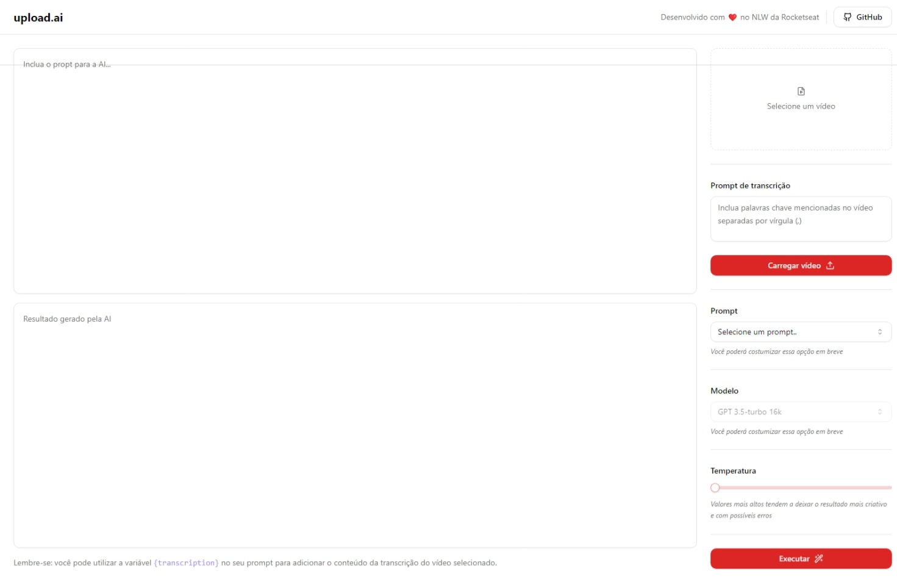

# NLW AI



Projeto criado na imersão NLW AI da Rocketseat

## Objetivo

Use a plataforma para criar em títulos e descrições para o YouTube usando seu próprio vídeo e o GPT 3.5 da OpenAI de forma automatica.

## Como executar

Em seu terminal, execute os comando abaixo para iniciar a API

```bash
cd api

pnpm install

pnpm run dev
```

Em seguida, execute os comando abaixo para iniciar a plataforma Web

```bash
cd web

pnpm install

pnpm run dev
```

## Tecnologias

- React
- Vite
- TypeScript
- TailwindCSS
- Radix UI
- Shadcn/ui
- Fastify
- ffmpeg
